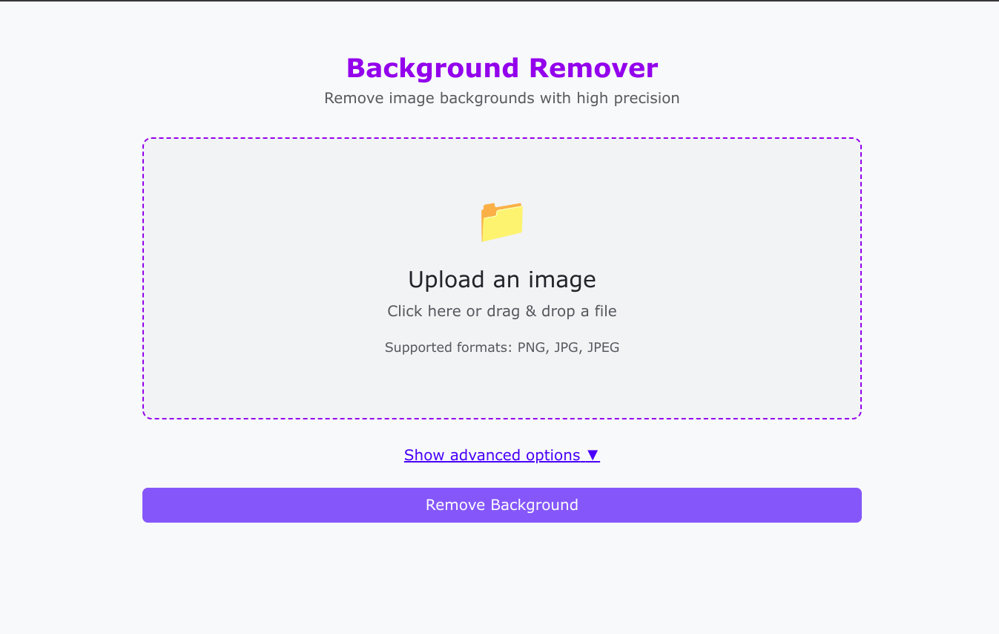
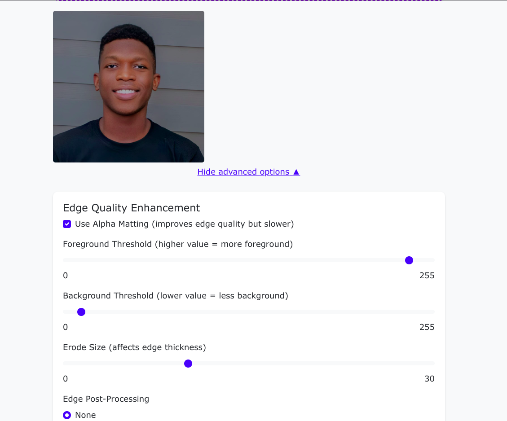
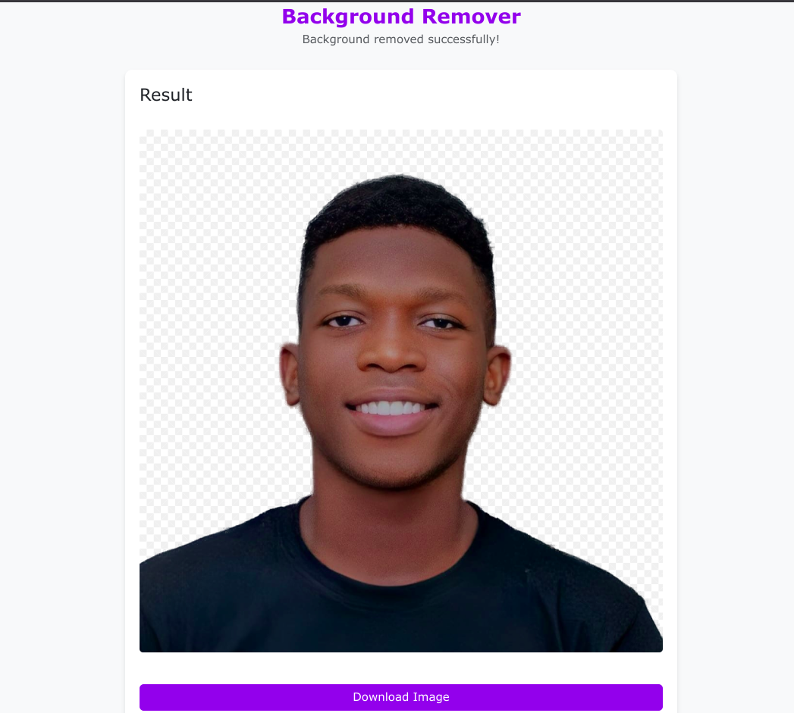

# Image Background Remover

A Flask web application for removing backgrounds from images with professional-quality results, similar to Canva's background removal tool.

## Features

- Clean, intuitive web interface with drag-and-drop functionality
- High-quality background removal powered by U2Net machine learning models
- Advanced edge refinement options including alpha matting
- Multiple post-processing options for edge improvement
- Works with PNG and JPEG image formats
- Downloadable results with transparent backgrounds

## Screenshots


*Upload page*


*Advanced options*


*Results page with transparent background output*

## Requirements

- Python 3.8 or higher
- Flask
- Pillow (PIL)
- rembg
- onnxruntime

## Installation

1. Clone the repository:
   ```bash
   git clone https://github.com/zyzer01/bg-remover.git
   cd image-background-remover
   ```

2. Create and activate a virtual environment:
   ```bash
   python -m venv venv
   
   # On Windows
   venv\Scripts\activate
   
   # On macOS/Linux
   source venv/bin/activate
   ```

3. Install dependencies:
   ```bash
   pip install flask pillow rembg
   ```

4. Install onnxruntime (choose one based on your system):
   ```bash
   # Standard installation
   pip install onnxruntime
   
   # For Apple Silicon (M1/M2/M3 Macs)
   pip install onnxruntime-silicon
   
   # For CUDA support (compatible NVIDIA GPUs)
   pip install onnxruntime-gpu
   ```

## Running the Application

1. Start the Flask server:
   ```bash
   python app.py
   ```

2. Open your web browser and go to:
   ```
   http://127.0.0.1:5000/
   ```

## Usage Tips

### Basic Usage
1. Upload an image by clicking the upload area or dragging and dropping
2. Click "Remove Background"
3. Download the resulting image with transparent background

### For Best Results

#### Portrait/People Photos
- Enable alpha matting
- Use "sharpen" post-processing
- Set foreground threshold to 240-250

#### Product Photos
- Enable alpha matting
- Use "enhance" post-processing
- Lower background threshold to 5-10

#### Fuzzy/Hairy Subjects (pets, etc.)
- Enable alpha matting
- Use "smooth" post-processing
- Set foreground threshold to ~220
- Set background threshold to ~20

## Project Structure

```
├── app.py                 # Flask application
├── uploads/               # Temporary storage for uploaded files
├── static/
│   └── outputs/           # Processed images with transparent backgrounds
└── templates/
    ├── index.html         # Upload page
    └── result.html        # Results page
```

## How It Works

The application uses the rembg library, which implements various U2Net models specifically trained for segmenting objects from backgrounds. When alpha matting is enabled, it uses additional algorithms to refine edges by analyzing color information, resulting in much smoother transitions and better preservation of semi-transparent areas.

## Troubleshooting

### Common Issues

1. **ModuleNotFoundError: No module named 'onnxruntime'**
   - Install the onnxruntime package: `pip install onnxruntime`

2. **Slow processing time**
   - Alpha matting significantly increases processing time
   - Consider using a smaller image or disabling alpha matting for faster results

3. **Out of memory errors**
   - Reduce image size before uploading
   - Close other memory-intensive applications

## License

This project is licensed under the MIT License - see the LICENSE file for details.

## Acknowledgments

- [rembg](https://github.com/danielgatis/rembg) - The excellent background removal library
- [U2Net](https://github.com/xuebinqin/U-2-Net) - The machine learning model behind the background removal